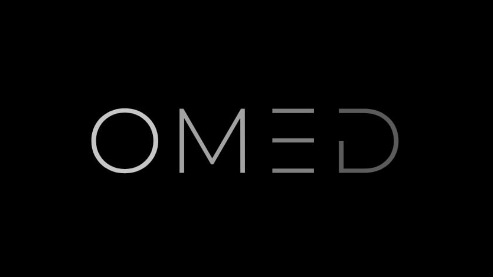

# Welcome to OMED - Your Software Development Partner

## About Us

OMED is a dynamic software development company dedicated to helping businesses and startups bring their ideas to life through cutting-edge technology solutions. With a passion for innovation and a commitment to excellence, we collaborate with our clients to build robust, scalable, and customized software applications.

## Our Services

### Custom Software Development

We specialize in crafting tailor-made software solutions to meet the unique needs and challenges of your business. Our experienced team of developers excels in creating scalable and efficient applications across various industries.

### Startup Acceleration

For startups looking to fast-track their development process, OMED offers comprehensive services, including MVP development, product strategy, and technical consultation. We help startups transform their ideas into successful, market-ready products.

### Technology Stack

Our expertise spans a wide range of technologies, including but not limited to:

- Frontend: HTML, CSS, JavaScript, React, Angular, Vue.js
- Backend: Node.js, Python, Ruby on Rails, Django
- Database: MySQL, PostgreSQL, MongoDB
- Mobile: React Native, Flutter
- Cloud: AWS, Google Cloud Platform, Azure

## Why Choose OMED?

- **Experienced Team:** Our team comprises seasoned professionals with a proven track record in delivering high-quality software solutions.
- **Agile Development:** We embrace agile methodologies to ensure flexibility, efficiency, and collaboration throughout the development lifecycle.
- **Client-Centric Approach:** Your success is our priority. We work closely with you to understand your goals and deliver solutions that exceed your expectations.
- **Cutting-Edge Technology:** We stay up-to-date with the latest technologies, tools, and trends to provide innovative and future-proof solutions.

## Get in Touch

Ready to embark on your software development journey with OMED? Contact us today to discuss your project and explore how we can help you achieve your business objectives.

- **Email:** info@omed.com
- **Website:** [https://www.omed.com](https://www.omed.com)
- **LinkedIn:** [OMED on LinkedIn](insert_linkedin_url)
- **Twitter:** [OMED on Twitter](insert_twitter_url)

Thank you for considering OMED as your software development partner! Let's build something extraordinary together.

---

© 2023 OMED. All rights reserved.
